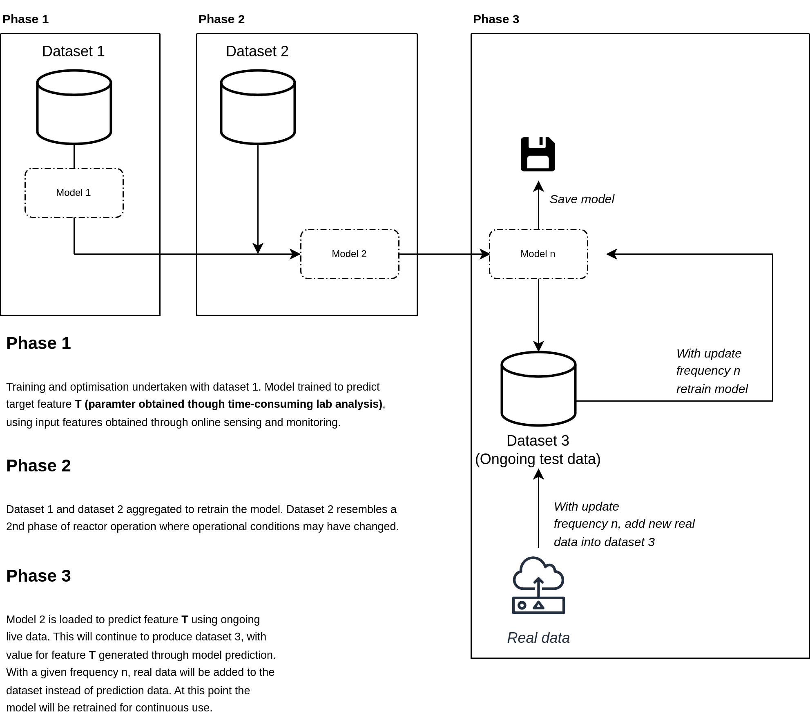

# soft_sensor
key information on data:

original training data -- complete_data.csv 
(original_data.csv, dataset from operation of mec-ad reactor controlled by threshold based autonomous feeding)
12.11.2023 - 20.11.2023 

transfer learning (retraining to new test phase) -- live_implementation.csv
(live_implementation.csv, dataset from 2nd phases of operation, water has been added to reactor to reduce thickness of digestate, this data is used in this pipeline to update the original model)
27.01.2024 - 20.02.2024 (data set length can be altered depending on what is to be used for soft sensor implementation data)

Data not used for original training or transfer learning -- soft_sensor_implementation.csv 
(This data uses a section taken form the end of the live_implementation.csv dataset, in aplication this will use live sensor data. Modelling with this aims to replicate how the model will function as a sensor for in the loop implementation)
(last n days of 27.01.2024 - 20.02.2024 data period)

