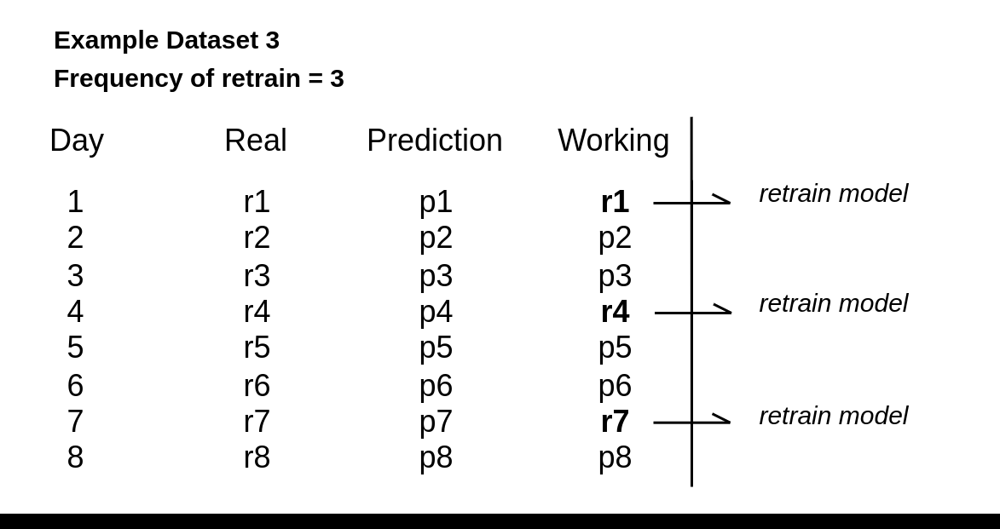
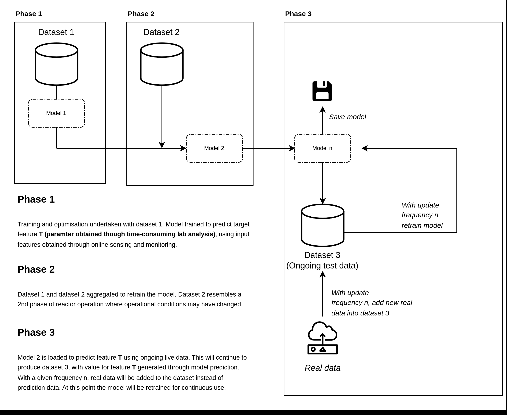

# sCOD soft sensor implementation
key information on data:

### Original training data -- Dataset 1
(dataset1.csv, dataset from operation of mec-ad reactor controlled by threshold based autonomous feeding)
12.11.2023 - 20.11.2023 

### Transfer learning (retraining to new test phase) -- Dataset 2
(dataset2.csv, dataset from 2nd phases of operation, water has been added to reactor to reduce thickness of digestate, this data is used in this pipeline to update the original model)
27.01.2024 - 20.02.2024 (data set length can be altered depending on what is to be used for dataset 3)

### Data not used for original training or transfer learning -- Dataset 3
(This data uses a section taken form the end of the dataset2.csv, in aplication this will use live sensor data. Modelling with this aims to replicate how the model will function as a sensor for in the loop implementation)
(last n days of 27.01.2024 - 20.02.2024 data period)

### Preperation of dynamic data for ongoing retraining in practical application

1. **Phase 1**:
Initial Training: A model, referred to as Model 1, is trained using Dataset 1. This phase involves training and optimization to predict a specific target feature (T), which is typically obtained through labor-intensive laboratory analysis. The input features for the model are collected through online sensing and monitoring.
2. **Phase 2**:
Retraining with Additional Data: The model undergoes a retraining process with an aggregated dataset that combines Dataset 1 and Dataset 2. This aggregation reflects a possible change in operational conditions, which Dataset 2 represents. The model retrained with this combined dataset is referred to as Model 2.
3. **Phase 3**:
Operational Use and Continuous Retraining:
Model Deployment: Model 2 is then used for ongoing prediction of the target feature T using live data, generating Dataset 3 which consists of predictions made by the model.
Data Integration: Real data is periodically integrated into Dataset 3 at a predefined update frequency 'n'. This step involves adding new, real data points to Dataset 3 to reflect actual outcomes.
Model Saving: The model's state is saved after it's been updated or at specific checkpoints.
Continuous Retraining: The model is retrained at regular intervals (at the update frequency 'n') with the new real data. This retraining ensures that the model remains accurate and adapts to new data patterns.

### Diagram of implemented pipeline

This example demonstrates how the model is periodically retrained with real data every 3 days to maintain prediction accuracy. The 'Working' column is updated with actual values and merged with other datasets as the target variable for retraining the model.

1. **Data Collection**: The model generates daily predictions (`p1`, `p2`, `p3`, ...). Simultaneously, real data points (`r1`, `r2`, `r3`, ...) are collected to evaluate the model's performance.

2. **Evaluation Phase (Optional)**: After every third day, an optional comparison between the model's predictions and real data points is conducted to assess the model's accuracy and determine the need for retraining.

3. **Retraining Decision**: The incorporation of real data into the 'Working' column prompts a retraining process. The example mandates retraining at every 3-day interval, as indicated by the annotations in the 'Working' column.

4. **Retraining Process**: The model is retrained with the actual data points accumulated to date. The updated 'Working' column, now containing real values, is used to fine-tune the model to the latest data trends.

5. **Model Deployment**: Once retrained, the model is redeployed into the production environment to continue providing daily predictions.

6. **Continuous Monitoring**: Ongoing performance monitoring ensures the model remains effective. The retraining schedule is adhered to, maintaining prediction quality over time.

