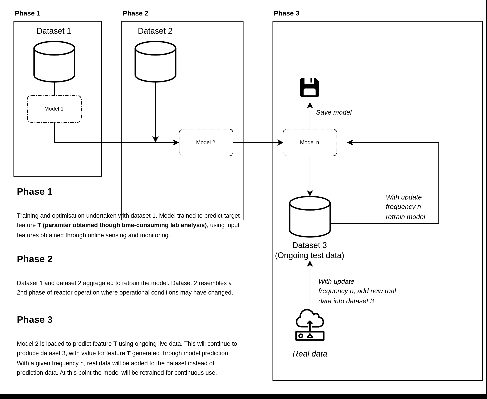

# sCOD soft sensor implementation
key information on data:

### Original training data -- Dataset 1
(dataset1.csv, dataset from operation of mec-ad reactor controlled by threshold based autonomous feeding)
12.11.2023 - 20.11.2023 

### Transfer learning (retraining to new test phase) -- Dataset 2
(dataset2.csv, dataset from 2nd phases of operation, water has been added to reactor to reduce thickness of digestate, this data is used in this pipeline to update the original model)
27.01.2024 - 20.02.2024 (data set length can be altered depending on what is to be used for dataset 3)

### Data not used for original training or transfer learning -- Dataset 3
(This data uses a section taken form the end of the dataset2.csv, in aplication this will use live sensor data. Modelling with this aims to replicate how the model will function as a sensor for in the loop implementation)
(last n days of 27.01.2024 - 20.02.2024 data period)

### Diagram of implemented pipeline

This example shows how the model can be retrained to update with real data every 3 days. 
The working column is appended to the other datasets as the target vairable and used to retrain the model.

1. **Data Collection**: The model initially makes predictions (`p1`, `p2`, `p3`, ...) for each day. Concurrently, real data points (`r1`, `r2`, `r3`, ...) are collected corresponding to the same timeframe (to assess model performance)

2. **Evaluation Phase (optional)**: At the end of the third day, the model's predictions are compared with the actual real data points collected up to that day. This comparison is critical for understanding the model's performance and the necessity of retraining.

3. **Retraining Decision**: When real data is transfered into the 'working column', this triggers a retraining process. In the given example, retraining is done regardless of the performance every 3 days. This is visible where the 'Working' column indicates the points at which 'retrain model' is annotated.

4. **Retraining Process**: During retraining, the model is updated with the real data points collected thus far. The 'Working' column is appended to the historical datasets, serving as the target variable. This ensures that the model learns from the most recent and relevant information.

5. **Model Deployment**: Post-retraining, the updated model is deployed back into the production environment, where it resumes making daily predictions.

6. **Continuous Monitoring**: The model is continuously monitored for performance, and the retraining cycle is repeated at the designated intervals to keep the model's predictions as accurate as possible.

### Preperation of dynamic data for ongoing retraining in practical application

